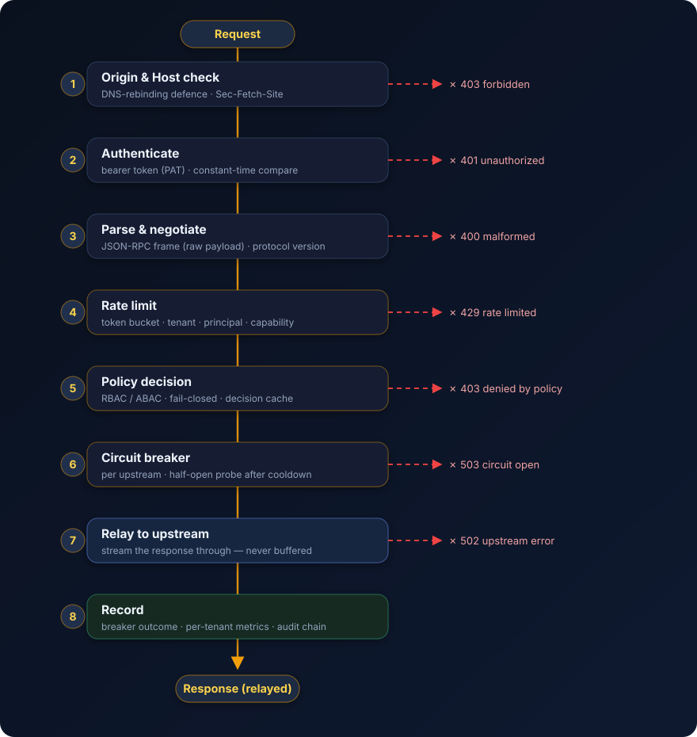

# Auditing

The audit log is append-only and **hash-chained**: each entry commits to the
previous entry's hash, so any modification, reordering, or deletion is
detectable. With a signing key, each hash is also HMAC-signed, so an attacker
who cannot read the key cannot rewrite the tail into a consistent chain.

<figure class="pc-figure">
  
  <figcaption>The request lifecycle. The <strong>audit</strong> entry is written at stage 8, after the response is relayed — on a background thread, off the hot path.</figcaption>
</figure>

```toml
[audit]
path = "portcullis-audit.jsonl"
secret_env = "PORTCULLIS_AUDIT_SECRET"  # optional; signs the chain
```

Writes happen on a background thread, so audit I/O never blocks request handling.
Opening a tampered log **fails closed**. Redaction happens at the boundary — a
configurable set of sensitive keys is masked recursively before anything is
written.
